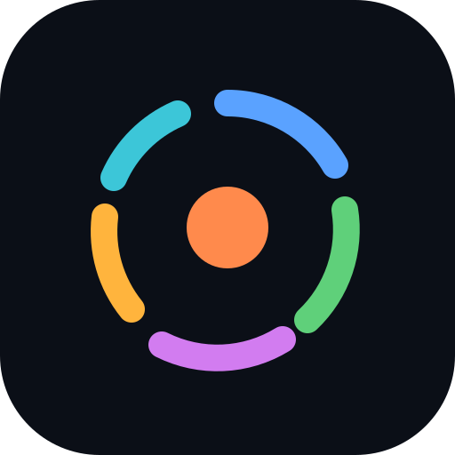
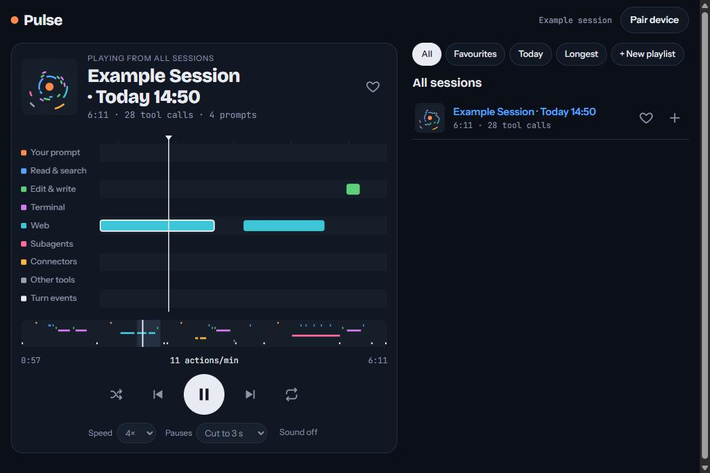

<p align="center"></p>

<h1 align="center">Pulse for Claude Code</h1>

<p align="center"><b>Hear and see Claude Code work.</b><br>
Every session becomes a track: a piano roll of what Claude did, with a sound for every move.<br>
Follow along live from your phone, replay the good ones, build playlists.</p>

<p align="center"></p>

## Get your own, in one click

Pick the database you like. Each button copies Pulse to your own GitHub and Vercel accounts and sets everything up. Free plans are enough.

| Database | |
|---|---|
| **Neon** (recommended) | [](https://vercel.com/new/clone?repository-url=https%3A%2F%2Fgithub.com%2Fkevinivarson-source%2Fpulse-for-claude-code&project-name=pulse&repository-name=pulse-for-claude-code&env=PULSE_KEY&envDescription=Make%20up%20a%20private%20key%20of%2012%20or%20more%20characters.%20It%20locks%20your%20player%20so%20only%20your%20devices%20can%20open%20it.&envLink=https%3A%2F%2Fgithub.com%2Fkevinivarson-source%2Fpulse-for-claude-code%23your-key&stores=%5B%7B%22type%22%3A%22integration%22%2C%22integrationSlug%22%3A%22neon%22%2C%22productSlug%22%3A%22neon%22%2C%22protocol%22%3A%22storage%22%7D%5D) |
| **Supabase** | [](https://vercel.com/new/clone?repository-url=https%3A%2F%2Fgithub.com%2Fkevinivarson-source%2Fpulse-for-claude-code&project-name=pulse&repository-name=pulse-for-claude-code&env=PULSE_KEY&envDescription=Make%20up%20a%20private%20key%20of%2012%20or%20more%20characters.%20It%20locks%20your%20player%20so%20only%20your%20devices%20can%20open%20it.&envLink=https%3A%2F%2Fgithub.com%2Fkevinivarson-source%2Fpulse-for-claude-code%23your-key&stores=%5B%7B%22type%22%3A%22integration%22%2C%22integrationSlug%22%3A%22supabase%22%2C%22productSlug%22%3A%22supabase%22%2C%22protocol%22%3A%22storage%22%7D%5D) |
| **Any other Postgres** | [](https://vercel.com/new/clone?repository-url=https%3A%2F%2Fgithub.com%2Fkevinivarson-source%2Fpulse-for-claude-code&project-name=pulse&repository-name=pulse-for-claude-code&env=DATABASE_URL,PULSE_KEY&envDescription=Make%20up%20a%20private%20key%20of%2012%20or%20more%20characters.%20It%20locks%20your%20player%20so%20only%20your%20devices%20can%20open%20it.&envLink=https%3A%2F%2Fgithub.com%2Fkevinivarson-source%2Fpulse-for-claude-code%23your-key) |

During setup Vercel asks for one thing:

<a id="your-key"></a>
**PULSE_KEY**: make up a private key of 12 or more characters, like a password. It locks your player so only your devices can open it.

## Start listening

1. Open `https://<your-pulse>.vercel.app/#pair=<your PULSE_KEY>` on your computer. That device is now paired.
2. Tap **Pair device → Copy Claude Code setup** and paste it into Claude Code. Claude installs the plugin and connects it for you.
3. Restart Claude Code and start working. Your session appears live in the player.
4. On your phone, open **Pair device** on the computer and scan the code, then add Pulse to your home screen.

## What you get

- **Live mode**: watch and hear Claude work in real time, about a second behind, on any device.
- **A library of sessions**: each one a track named by project and time, with cover art drawn from its own rhythm.
- **Shuffle, repeat, favourites and playlists**, synced across your devices. Smart lists for Today, Longest and each project.
- **Lock-screen controls** on phones, and it installs like an app.
- **Private by design**: your sessions live in your own database. Pulse records only event types, tool names and the project folder name, never your prompts, code or files.

## What you hear

| Lane | Sound |
|---|---|
| Your prompt | Kick drum |
| Read and search, edit and write, terminal, web, subagents, connectors | A note each, on a pentatonic scale, so it always sounds musical |
| Each tool finishing | A soft tick |
| Claude finishes a turn | A chord |
| Claude is waiting for you | A bell |
| Context compaction | A swell |

## How it works

```
Claude Code ──(plugin: one tiny line per event)──► your Vercel app ──► your Postgres
                                                        ▲
                       phone / tablet / computer ───────┘  (live, about once a second)
```

- **plugin/** is a Claude Code plugin made of hooks. It writes a local backup in `~/.claude/pulse` and sends events in the background. It never slows Claude down, and catches up if you were offline.
- **api/** has four small endpoints: ingest, sessions, events and library. Tables are created automatically on first run.
- **index.html** is the whole player: one file, no framework, no build step.

## Build on it

Be my guest. Fork it, change it, make it yours. Ideas and improvements are welcome as issues or pull requests.

Run it locally with `npx vercel dev` and a `DATABASE_URL` pointing at any Postgres.

## License

MIT. Use it freely; it comes with no warranty. Made by Kevin Ivarson with Claude.

<sub>Pulse is an independent project and is not affiliated with or endorsed by Anthropic.</sub>
